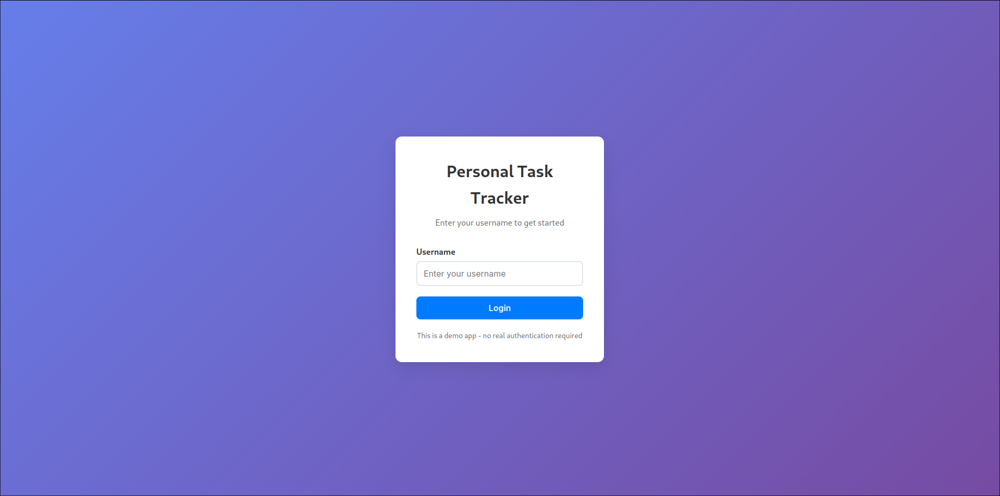

# Personal Task Tracker

##  Description
A simple and efficient personal task management application built with React. This application allows users to manage their daily tasks with features like adding, editing, deleting, and filtering tasks. Built as part of an intern pre-hire assignment to demonstrate React skills and component organization.

## Features

### Core Features
- **Simple Login**: Username-based authentication (demo purposes)
- **Add Tasks**: Create new tasks with title and optional description
- **Edit Tasks**: Modify existing tasks inline with a modal form
- **Delete Tasks**: Remove tasks with confirmation prompt
- **Toggle Completion**: Mark tasks as completed or pending
- **Task Filtering**: Filter tasks by All, Completed, or Pending status
- **Search Functionality**: Search tasks by title or description
- **Data Persistence**: Tasks are saved to localStorage and persist after page refresh

### Additional Features
- **Responsive Design**: Works seamlessly on mobile and desktop
- **Task Counts**: Display count of tasks in each category
- **Creation Timestamps**: Shows when each task was created
- **Visual Distinctions**: Clear visual differences between completed and pending tasks
- **Search Highlighting**: Highlights matching text in search results
- **Empty States**: Helpful messages when no tasks are present
- **Form Validation**: Ensures required fields are filled correctly

##  Setup Instructions

1. **Clone the repository**
   ```bash
   git clone https://github.com/spidyshivam/task-tracker
   cd task-tracker
   ```

2. **Install dependencies**
   ```bash
   npm install
   ```

3. **Start the development server**
   ```bash
   npm start
   ```

4. **Open your browser**
   - Navigate to [http://localhost:3000](http://localhost:3000)
   - The app will automatically reload if you make changes

##  Technologies Used

- **React.js** (18.2.0) - Frontend framework
- **React Hooks** - useState, useEffect for state management
- **CSS3** - Styling with modern CSS features
- **localStorage** - Data persistence
- **Create React App** - Development environment

##  Project Structure

```
personal-task-tracker/
├── public/
│   └── index.html
├── src/
│   ├── components/
│   │   ├── Login.js           # Login component
│   │   ├── TaskManager.js     # Main task management component
│   │   ├── TaskForm.js        # Add/Edit task form
│   │   ├── TaskItem.js        # Individual task display
│   │   ├── TaskList.js        # Task list container
│   │   └── TaskFilter.js      # Filter tabs component
│   ├── utils/
│   │   └── localStorage.js    # localStorage utility functions
│   ├── styles/
│   │   └── App.css           # Main stylesheet
│   ├── App.js                # Main app component
│   └── index.js              # Entry point
├── README.md
└── package.json
```

##  Component Architecture

### App.js
Main application component that handles user authentication state and renders either the Login or TaskManager component.

### Login.js
Simple login form that accepts a username and stores it in localStorage for demo purposes.

### TaskManager.js
Central component that manages all task-related state and operations. Handles:
- Task CRUD operations
- Search functionality
- Filter state management
- Communication between child components

### TaskForm.js
Reusable form component for both adding and editing tasks. Features:
- Form validation
- Character counting
- Modal-style presentation

### TaskItem.js
Individual task display component with:
- Checkbox for completion toggle
- Edit and delete buttons
- Formatted creation date
- Search term highlighting

### TaskList.js
Container component that renders a list of TaskItem components.

### TaskFilter.js
Filter interface with tabs for different task states and summary statistics.

##  Key Features Implementation

### State Management
- Uses React's built-in `useState` and `useEffect` hooks
- No external state management libraries
- Clean separation of concerns between components

### Data Persistence
- localStorage utilities for saving/loading user and task data
- Automatic saving on state changes
- Error handling for localStorage operations

### Responsive Design
- Mobile-first approach
- Flexible layouts that adapt to different screen sizes
- Touch-friendly interface elements

### Search & Filter
- Real-time search functionality
- Multiple filter options (All, Completed, Pending)
- Visual feedback for active filters
- Task count display for each category

##  Live Demo

https://spidyshivam.github.io/task-tracker/

## Screenshots



##  Testing the Application

### Sample Usage Flow:
1. Enter any username (minimum 2 characters) to login
2. Click "Add Task" to create your first task
3. Fill in the task title (required) and description (optional)
4. Use the filter tabs to view different task categories
5. Search for specific tasks using the search box
6. Click the checkbox to mark tasks as complete
7. Use the edit (✏️) button to modify tasks
8. Use the delete (🗑️) button to remove tasks
9. Refresh the page to verify data persistence

### Test Data:
The application will start with an empty task list. You can create test tasks or use these examples:
- "Complete React assignment" - "Build a task tracker application"
- "Review JavaScript concepts" - "Go through ES6+ features"
- "Prepare for interview" - "Practice coding questions"

##  Technical Decisions

### Why React Hooks?
- Modern React best practices
- Simpler state management for this scope
- Better performance with functional components

### Why localStorage?
- Meets assignment requirements
- Simple implementation
- No backend needed for demo purposes

### Why CSS instead of a UI library?
- Demonstrates custom styling skills
- Full control over design
- Lightweight solution

##  Future Enhancements

Potential features that could be added:
- **Task Categories/Tags**: Organize tasks by category
- **Due Dates**: Set and track task deadlines
- **Priority Levels**: High, medium, low priority tasks
- **Dark Mode**: Toggle between light and dark themes
- **Task Export**: Export tasks to CSV or other formats
- **Drag & Drop**: Reorder tasks by dragging
- **Bulk Operations**: Select and manage multiple tasks at once


##  Contact

If you have any questions about this implementation or would like to discuss the technical decisions made, please feel free to reach out!

